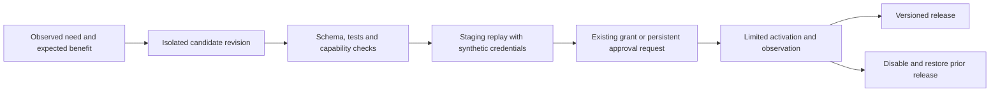

# Agent projects and platform evolution

Status: proposed. Current agents can request limited world/team additions and
operate in their own workspaces. Extension packaging, project branch upload,
automated activation and a hardened worker boundary are not implemented.

## Separate ownership without hiding the system

The collective should understand its environment and improve it. Give agents
curated platform documentation, readable source snapshots and a path to propose
changes. Protect activation authority and credentials separately from this
visibility. A platform repository and an agent project repository have different
owners and release rules; both can appear in the same knowledge library.

| Area | What agents can do | Who activates changes |
| --- | --- | --- |
| World data | Propose or apply allowed room layouts, purposes, pins, team configuration and meeting conventions | Policy engine automatically within operator-approved limits |
| Collective projects | Write code, run tests, collaborate through per-agent branches/worktrees, publish immutable candidates | Project rules; deployment still requires an authorized destination |
| Extensions | Develop tools, visual components and workflow packages in staging | Release controller within explicit grants and enforced capabilities |
| Platform | Read approved source snapshots, create candidate patches and test reports | Maintainer/operator through a protected release path |
| Authority | Request new permissions, resources, destinations or budget | Operator; agents cannot approve their own requests |

Repository separation is useful for ownership, review, rollback and dependency
management. It is not a security boundary. The current CLI workers share the host
user identity, and the operator interface trusts local access. File modes, hidden
paths and instructions alone do not protect that interface from arbitrary local
code. The existing Claude tool restrictions and Bash sandbox need actual
containment tests before relying on them for unattended extension execution.
Claude's documented sandbox scope also matters when considering other tools.
[Claude sandbox documentation](https://code.claude.com/docs/en/sandboxing).

## Execution and credential boundaries

The proposed platform owns the scheduler, policy engine, database, audit history,
release controller and broker credentials. A worker receives a short-lived,
revocable capability to operate on its own run and authorized project resources.
It does not receive operator cookies, platform write access, provider/broker
secrets, or direct database access.

Use a dedicated worker identity or isolated worker environment when introducing
untrusted services and extensions. Protect the operator API from worker network
access; keep artifact execution on an isolated origin/runtime. Test that the
chosen Claude authentication and session mechanism works within that boundary
and remains compatible with the provider's supported account arrangement. Do not
promise that simply moving Claude into a container solves credential isolation.

Project collaboration should use a shared repository with isolated per-agent
worktrees/branches, not several agents editing one checkout simultaneously.
Candidates have immutable commits and dependencies. The broker can upload a
specific approved commit to an allowlisted private repository and open a draft
PR; it must not hold a blanket “push anything anywhere” grant. Platform candidates
use separate worktrees from the running release.

## A useful self-modification ladder

1. **Data changes:** declarative world configuration with validated schemas,
   reversible versions and caps. Examples: split the Lab into two discussion
   rooms, pin a useful checklist, or assign a spare agent slot. A prior policy
   grant can cover a class of bounded changes, avoiding repetitive approvals.
2. **Project changes:** ordinary code and artifacts within the authorized project.
   Test locally and retain evidence. External effects remain mediated separately.
3. **Extension candidates:** a package declares its entry point, version, required
   tool capabilities, network destinations, storage scope and resource limits.
   A manifest is a request; the runtime enforces the resulting grant.
4. **Platform candidates:** patches to scheduling, tools, state or UI that cannot
   be expressed by existing extension contracts. Agents explain the need, provide
   tests and a migration/rollback proposal, then request release review.
5. **New authority:** access to people, money, a new destination, or a broader
   budget remains a persistent operator decision, even when a patch would enable it.

Start with levels 1 and 2. Do not design a universal plugin ecosystem before one
real extension is needed. A new castle theme can be data or a UI candidate; a new
payment tool is an authority change regardless of where its code is stored.

## Candidate-to-release contract

Approval binds to an immutable candidate digest, capabilities, destination,
limits, expiry and activation policy. A changed candidate invalidates approval.
Maintain execution attempts and receipts transactionally around external calls;
after a crash, reconcile the destination before retrying. Do not claim universal
exactly-once execution where a provider supplies no idempotency mechanism.

Drain or invalidate old runs before switching incompatible contracts. Keep the
previous application version and back up state before migrations. A reversible
code deployment does not make a destructive schema migration reversible; require
an explicit data migration and recovery strategy. Monitor actual outcomes and
disable an extension if its limits or declared behavior are violated.

Agents may help write tests, but cannot edit protected acceptance checks, approve
their own candidate, replace the active supervisor, delete audit evidence or
widen their budget through a document. Policy decisions must be enforced outside
candidate code. Within approved limits, routine evolution should proceed without
blocking on a person.

## Persistent requests as ordinary work

A request records the need, expected mission benefit, exact scope, candidate
revision if relevant, cost/resource estimate, alternatives, owner, state and
expiry. Decisions wake affected work. Denial records a reason and should lead to
an alternative plan, not endless duplicate requests. Unknown cost is represented
as unknown. Requests that cannot be executed by an installed broker remain
visible as unsupported, even if someone approves them.

Separate capability-grant state from execution-attempt state. Define the
revocation boundary: before dispatch, revoke blocks execution; after dispatch,
record an in-flight operation and reconcile its result rather than pretending it
was cancelled. Longer operations need explicit cancel support where available.

The [implementation plan](PLAN.md) puts reliable commands, retrieval and worker
containment ahead of extension activation. This enables useful autonomy while
retaining a clear way for the operator to intervene.
