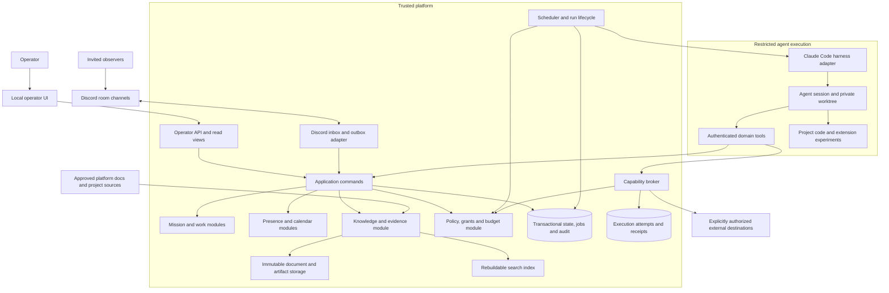
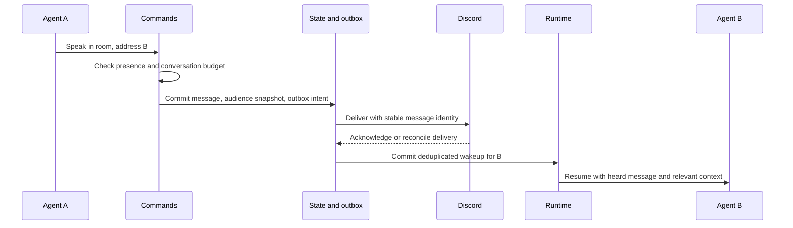

# High-level architecture

Status: proposed target for the next iteration. See [assessment](ASSESSMENT.md)
for what currently exists and [plan](PLAN.md) for implementation order.

## Product and operating model

An operator gives a broad mission and boundaries. Persistent agents form a
working approach, coordinate in Discord rooms, produce evidence, evaluate it,
and adapt. A room determines who hears live conversation. The environment also
provides useful context: room purpose, project focus, booked time, pinned
knowledge, and available resources. Graphics project this state; they do not
own scheduling or agent behavior.

Initial deployment: one personal collective, one local supervisor, a small team,
two concurrent model episodes, Discord observers, and a constrained subscription
budget. These are configuration defaults, not a measured capacity claim.

## Components and authority



These are module boundaries inside one application initially. Separate processes
are justified for executing generated code and protecting credentials. They do
not require every domain module to become a network service.

## State owners

| Module | Owns | Does not own |
| --- | --- | --- |
| Missions | Mission revisions, outcome criteria, experiments, operator feedback | Provider sessions or permissions |
| Work | Tasks, dependencies, evidence submissions, reviews | Claims that task count proves goal success |
| World | Rooms, presence history, conversation audiences, calendar reservations | Authority to access a resource merely by entering a room |
| Knowledge | Documents, revisions, sources, relationships, retrieval | Execution policy derived from document text |
| Policy | Approved capabilities, constraints, revocation and budget reservations | Agent reasoning or self-asserted authority |
| Runtime | Jobs, leases, episode attempts, cancellation, checkpoints | Model tool-loop internals |
| Transport | Discord delivery, inbox deduplication, cursor checkpoints | Canonical mission/task/knowledge state |
| Project/release | Worktrees, candidate revisions, tests, release activation | Unreviewed edits to the running supervisor |

Use SQLite records as canonical operational state, immutable blobs as evidence,
and explicitly registered Markdown/Git sources as canonical platform documents.
Search indexes, Discord embeds, UI cards, and context packets are projections
with source/version references. Do not make Discord history or CLI transcripts
the only copy of important knowledge.

## Application contracts

Every mutating tool becomes a typed application command carrying:

```ts
type CommandContext = {
  principalId: string;       // Authenticated by the ingress adapter
  collectiveId: string;
  missionId?: string;
  missionRevision?: number;
  runId?: string;
  idempotencyKey: string;
  expectedVersion?: number;  // Optimistic concurrency, where applicable
};
```

Adapters derive principal and scope; they do not accept an agent's supplied
identity as proof. Validate resource ownership, mission generation, transition,
and grant at the command boundary. The command commits related records, jobs,
events, and external intents in one transaction. Retried commands return the
previous result. External calls never hold a database transaction open.

Use an audit log plus current state and durable delivery tables. Do not promise
that the current log can reconstruct all state, or introduce full event sourcing
without a separate reason. A worker lease has owner, expiry, and generation;
late output from an expired generation cannot mutate current state.

## Conversation flow



Presence is evaluated when speech is accepted. A listener who later moves retains
what they already heard. Historical room access is a separate policy. A meeting
creates bounded speaking turns or addressed wakeups, not an unrestricted
all-to-all loop. Save missed meetings and outcomes explicitly.

In live mode, Discord is a required transport for conversation. During an outage,
hold conversational delivery; initially pause new live episodes conservatively.
Buffer incoming gateway events while replaying history, then deduplicate and
advance per-room checkpoints transactionally. Do not silently fall back to a
private channel that invited observers cannot see.

## Work and progress flow

The first task-level implementation is recorded in
[criterion-bound evaluation](PROGRESS-IMPLEMENTATION.md), including its concrete
module/data flow and limits. The broader outcome-observation flow below remains
a target.

Mission revision → proposed approach → experiment or task → immutable evidence →
evaluation → review → outcome observation → continue, revise, or request acceptance.

A broad mission may have no honest numeric success definition initially. The
first output can be a proposed direction and a falsifiable experiment. Record
proxy metrics as proxies. For a game, “build passes” and “players understand it”
are different criteria; the latter may require a human session authorized by the
operator. Evidence records specify what was checked, by whom, against which
criterion version, with failures and limitations retained.

Each episode starts with a bounded context packet: mission, current assignment,
relevant decisions, outstanding blockers, allowed operations, and source links.
It finishes with structured work references and a concise handoff. Session
resumption is an optimization; durable knowledge must permit another agent or a
fresh session to take over.

## Proposed code layout

```text
src/
  domain/             # Types, schemas, pure transition rules
  application/        # Mission/work/world/knowledge/policy commands
  ports/              # Repository, harness, transport and capability interfaces
  infrastructure/
    sqlite/           # Migrations, repositories and transactions
    claude/           # CLI lifecycle and provider quota compatibility
    discord/          # Transport, inbox/outbox and presentation
    capabilities/     # Scoped executors, receipts and reconciliation
  runtime/            # Scheduler, run leases and context assembly
  http/               # Authentication, routes and bounded read models
public/               # Format and split current UI modules by view
docs/                 # Registered platform documentation
```

Move one use case at a time. Retain the existing tool names and HTTP behavior
through adapters while extracting ownership and tests. Prefer concrete domain
repositories over rebuilding the current generic `all()` store behind a new name.

## Scaling strategy

The immediate scale problems are history scans, oversized context, duplicate
work, coordination cost, and brittle recovery. A larger server or more agents
would not solve them.

Keep SQLite and the single supervisor for the personal pilot. Use indexed SQL
queries, bounded pages, compact read views, batched SSE invalidations, per-mission
budgets, and content-addressed blobs. SQLite's documented single-writer behavior
fits this deployment; multiple independent writer hosts or measured contention
would justify a client/server database.
[SQLite deployment guidance](https://sqlite.org/whentouse.html).

Introduce remote workers only behind authenticated run leases and scoped tools;
they must not open a shared SQLite file over a network filesystem. Consider
PostgreSQL and a durable distributed queue when deployment needs require them.
Do not add a separate graph/vector database, microservices, or orchestration
cluster for the initial team without measured evidence.

The [plan](PLAN.md) defines proposed load and recovery gates. They are targets
to test, not performance promises. The [knowledge design](KNOWLEDGE.md) and
[evolution design](EVOLUTION.md) supply the two most consequential contracts.
