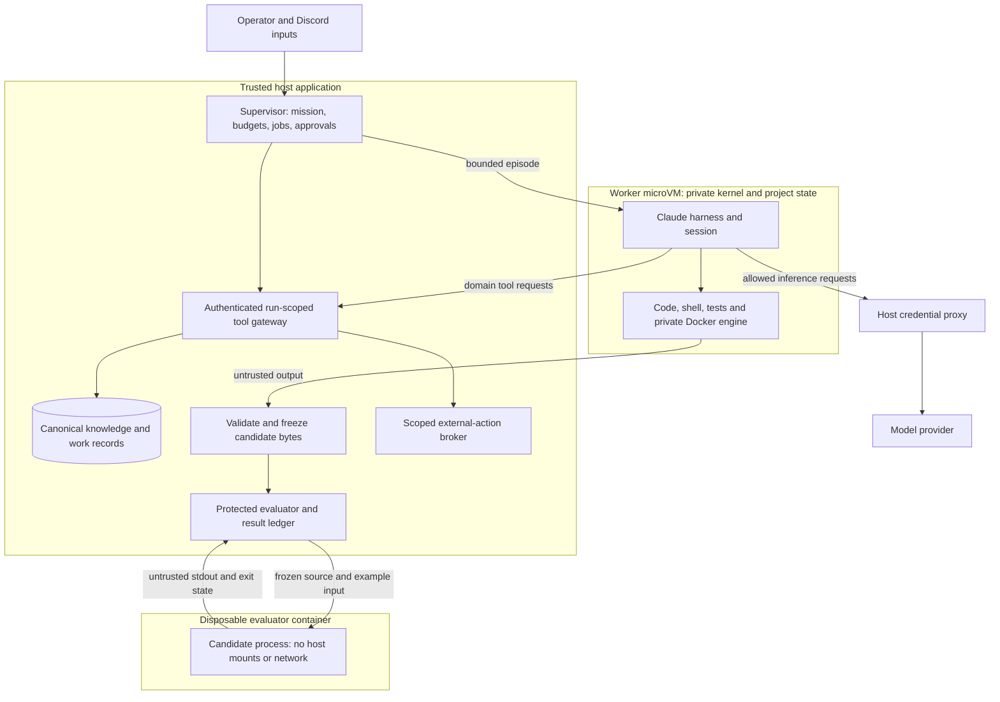

# Isolation architecture and threat model

Status: architecture and explicit acceptance contract, 2026-09-24. The
[candidate rehearsal](ISOLATION-REHEARSAL.md) and initial
[worker VM rehearsal](WORKER-REHEARSAL.md) record measured results; authenticated
whole-worker integration remains open. This document explains what isolation means for
Collective and which safeguards exist independently of the sandbox product.
The [worker review](REVIEW-2026-09-24.md) corrects the original lifecycle evidence
and records the current, stricter acceptance results.

## Definition

Isolation means an agent and the code it executes can affect only explicitly
granted resources, even if that code is buggy or attempts to bypass instructions.
Enforcement must live outside the worker's control. It is more than a separate
directory, process, Claude conversation, role, avatar or room.

An isolated worker must not directly read or change the supervisor database,
operator session, platform checkout, evaluator, raw host credentials, another
worker's private files, or host services. It may communicate and publish through
authenticated, scoped gateways. The supervisor must be able to stop its process
tree and bound resource consumption. Each allowed path across the boundary is a
capability to account for, not an exception we can ignore.

This is a practical containment contract, not mathematical noninterference.
Workers intentionally share knowledge and room messages through the application.
They share physical hardware, so performance interference and hardware side
channels are outside this MVP's claims. The host OS, hypervisor, container
runtime, broker and maintainer account remain trusted.

## Three responsibilities

This is the target topology. The current candidate rehearsal uses ordinary
Docker Desktop containers; the entire Claude worker is not yet integrated with
Docker Sandboxes. The protected production ledger presently evaluates JSON data,
not executable candidates. Keep those distinctions when reading the diagram.

**Supervisor.** Owns goals, budget admission, canonical knowledge, scheduling,
permissions and results. It validates tool requests independently of prompts and
worker configuration. Credentials used for GitHub/Discord belong here or in the
host credential proxy. The local operator HTTP interface is not a worker tool.

**Worker.** A private execution environment for one active agent/project writer,
not one room. It needs persistent files and Claude session data between bounded
episodes. It can edit its own project and run development tools. Root access in
its VM is not root access on the host; configuration writable by that root cannot
serve as the application's ultimate authority boundary.

**Evaluator.** A fresh disposable environment runs a frozen candidate. The trusted
host sends inputs and compares observed output to a maintainer-owned oracle.
Candidate code never runs in the same process as the oracle. The candidate can
print “pass,” replace its own tests, or monkey-patch its own JavaScript globals;
none of that changes the host's comparison or required evidence identities.

## Containers versus Docker Sandboxes

An ordinary Linux container isolates processes and resources using namespaces,
control groups, filesystem mounts, capabilities and syscall filtering. Containers
on one Docker engine share its kernel. On this Mac, Docker Desktop supplies the
Linux VM that hosts those containers. The rehearsal's container is disposable,
non-root, read-only except for bounded scratch space, and has no network or host
mounts. Its measured controls and exact limits are in the
[rehearsal report](ISOLATION-REHEARSAL.md#results-and-corrections).

Docker **Sandboxes** (`sbx`) is a separate product with a microVM per sandbox,
including a private kernel and Docker engine. It offers a larger boundary for
an entire coding harness. Credentials and network requests pass through host
proxies. Sharing a directory, skill store, signing socket or MCP tool deliberately
opens a path across that boundary. Our worker test uses no host workspace mount,
shared skills or SSH forwarding. See Docker's
[isolation layers](https://docs.docker.com/ai/sandboxes/security/isolation/) and
[security model](https://docs.docker.com/ai/sandboxes/security/).

The older Docker Desktop installation used for controlled candidate fixtures is
not the new `sbx` runtime, and is not a maintained baseline for autonomous code.
Installing a current `sbx` binary does not upgrade that older engine. A future
evaluator deployment also needs a maintained runtime and fresh containment checks.

## What must be prevented

| Boundary | Prevention and acceptance evidence | Current position |
| --- | --- | --- |
| Host files and state | No host home/platform/database mount; synthetic read/write and symlink escape attempts must fail | Candidate and mountless worker fixture probes passed; clipboard write bridge remains unresolved |
| Other workers | Separate private files/processes; shared state only through approved application tools | Two VMs had private workspaces, distinct kernels and Docker engines; session-volume and peer-network verification pending |
| Credentials | No raw provider/API/GitHub/Discord credentials in worker environment or files; no SSH signing socket | Worker SSH access denied; subscription proxy behavior pending; integration variables still present |
| Network and local services | Default-deny egress, exact provider/gateway exceptions; deny supervisor/operator endpoints and arbitrary public writes | Candidate has no network; worker deny-all proxy/direct exchange probes passed; scoped allowlist pending |
| Authority | Mission/job attempt fencing, principal checks and exact permissions in supervisor; worker cannot grant itself more rights | Existing application tests; whole-worker gateway integration pending |
| Evidence integrity | Exact candidate hash, frozen criteria, external oracle, immutable submission/review records | Production data checks implemented; executable rehearsal linked to fixture submissions only |
| Resource use | CPU, memory, process, output and wall-clock limits; verified stop and cleanup | Candidate OOM/process limits passed; worker stop/restart killed a detached process and preserved files; durable lifecycle and stress testing pending |
| Persistence and evolution | Worker changes cannot silently become platform configuration or deployed tools | Protected knowledge sources and permission system implemented; project export/release lifecycle pending |

The matrix is intentionally narrower than saying “the system is sandboxed.”
A passing test for one column does not prove the other boundaries.

## Deliberate communication paths

An MCP connection is an API boundary, not magic containment. A local MCP server
can run on the host with host permissions. The gateway must expose only the
Collective domain operations intended for that run; it must not expose a generic
host shell, filesystem server, Docker socket, or operator API. A copied/replayed
run token must fail after pause, cancellation, mission replacement or stale attempt.
The existing native MCP path has tests for these application checks; the new VM
transport needs its own test. See [execution design](designs/01-execution.md).

Keeping a provider token out of the VM prevents raw-token theft. It does not
prevent a compromised worker from making requests using the proxy's allowed
authority. Provider access can still consume allowance and transmit project
content. Quota admission, restricted destinations and eventual hard metered
reservations are separate concerns. Subscription-plan readings cannot promise
an exact dollar cap.

Network policy also does not establish intent: an allowed domain can expose many
actions. Public publishing, money and human contact therefore need separate
broker capabilities and user-defined scopes. A sandbox test grants none of them.

The platform repository's maintainer GitHub remote is separate from agent GitHub
access. Pushing this application's reviewed source does not configure the agent
broker, grant a worker Git credentials, or enable autonomous PR creation.

## What isolation does not prove

Isolation does not make agent output correct, useful, honest or aligned with an
open-ended mission. It does not stop every prompt injection from influencing an
agent's beliefs, or make malicious content harmless after a human runs it outside
the boundary. It does not prove service availability, data backup, multi-tenant
security, zero kernel vulnerabilities, or a hard subscription spending cap.

That is why frozen evidence, independent review, meaningful outcome measurement,
scoped approval and rollback accompany the sandbox. Worker-created tools and
world changes can be proposed and tested, then activated through a controlled
release path; they do not automatically rewrite the supervisor. See
[controlled evolution](EVOLUTION.md) and [workspace/PR design](designs/03-workspaces-prs.md).

## Gate for proceeding

The foundation is sound enough to proceed with the bounded worker compatibility
experiment. Unattended live operation stays disabled until it proves non-interactive
Claude execution, subscription authentication, resume, cancellation, scoped MCP,
quota behavior and host/peer containment. Executable task acceptance also needs
durable evaluation intents, recovery and result reconciliation. No broad feature
expansion or claim of production readiness follows from the candidate rehearsal.
