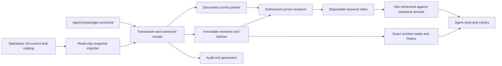

# Shared knowledge implementation

Status: implemented bounded increment, 2026-09-23. The broader
[knowledge architecture](KNOWLEDGE.md) and [integration design](designs/02-knowledge.md)
remain targets. This record describes what the code implements and where it stops.

## Scope and source control

The platform is now a local Git repository on `main`. Its application/tests and
architecture/research baseline were committed separately before this work began.
There is no remote, GitHub account connection or PR setup. The local commit
identity uses Sam Mindlin with a `sam@localhost` placeholder. Runtime databases,
backups, secrets, dependencies and generated builds are ignored.

This increment adds durable document identity, immutable revisions, exact reads,
keyword search, protected core-document import and a Library interface. It does
not add a semantic answer generator, autonomous fact extraction or a wiki editor.
No knowledge dependency was added to the application.

## Data and command contracts

- `knowledge_documents` owns stable IDs, namespace, owner, visibility, mission,
  lifecycle, current revision and conflict heads. Access predicates have an index.
- `knowledge_revisions` retains immutable title/body, kind, recorded/proposed
  status, sources, author, parent IDs, full-content SHA-256 and source provenance.
  SQL triggers reject revision updates and deletion. The application repository
  owns writes; direct database access is trusted supervisor access.
- `knowledge_generation` invalidates derived search state after content or access
  changes. Indexes are in memory and rebuilt on demand from canonical records.
- Revision insertion, document pointer, generation, audit and command receipt share
  one transaction. The existing receipt protocol now also covers `knowledge_write`.
  A client retries one ambiguous HTTP failure using the identical command ID.
- A revision requires the exact current `previousId`; a stale editor must reread
  and reconcile. Historical revision IDs remain citations. Metadata supplied by
  an agent cannot promote a note into the platform/operator namespace.

Supported tools:

| Tool | Contract |
| --- | --- |
| `knowledge_write` | Create shared `collective` or private `agent` notes; revise with current `previousId`; use stable `commandId` for retry safety |
| `knowledge_get` | Exact document/revision read; agent responses default to 8,000 characters, cap at 12,000, and return `nextOffset`, total size and full-source citation |
| `knowledge_history` | Paged revisions and conflict heads; 20 results maximum |
| `knowledge_search` | All literal keywords must match; at most 24 keywords and 20 hits; empty query browses the catalog |

An identical retry returns the original result, even if the document was later
revised. Read the current document before making a new edit. Notes from earlier
missions remain searchable but are read-only; create a new sourced note when
bringing a prior finding into a new mission. Legacy notes with unknown mission
scope remain shared historical material, with legacy provenance visibly retained.

## Authority and core documents

Startup reads `docs/catalog.json` and its registered Markdown directly from the
local platform repository's `HEAD` commit. Git is required. Uncommitted edits are
not imported. `HEAD` is the maintainer-selected local release snapshot; a Git
commit is not a signature or a substitute for an isolated worker boundary.

The importer checks the configured repository root, normalized documentation
paths and regular Git blob modes. Symlinks, escaping paths, mismatched namespace
IDs and duplicate registrations reject the import. There is no agent import tool,
raw index endpoint or agent-selectable filesystem root. Imports are atomic;
unchanged content and registration metadata retain their existing revision.
Changed content or audience produces a traceable revision. Removed registrations
are withdrawn and unavailable to agents; operators retain historical inspection.

Imported documents preserve their source kind and status. A **proposed** design
stays proposed. A search hit or agent-authored front matter cannot change runtime
permissions. Agent notes remain observations/judgments regardless of their title.

The initial access model is deliberately small: shared collective notes, private
notes owned by one agent, and explicitly registered platform/operator sources.
The local operator can inspect all of them. Project groups, tenant isolation and
arbitrary ACL editors are not implemented. Old task evidence IDs still resolve;
private notes cannot be submitted as shared task evidence, and acceptance checks
that cited knowledge is still readable by the reviewer.

## Retrieval experiment and provisional choice

The [frozen screening result](knowledge-retrieval-results.json) compares QMD
2.8.3 lexical search with SQLite FTS5 on the same 1,020 documents and 13 queries
(12 answerable, one intentionally unanswered). It includes the source commit,
fixture hash, expected results, actual hits, per-query times and runtime versions.
The fixture includes the 17 baseline documents, three synthetic notes and 1,000
newer distractors. It is a small engineering screen, not a production benchmark.

| Metric | SQLite baseline | QMD lexical |
| --- | --- | --- |
| Mean recall@5 across answerable queries | 0.75 | 0.75 |
| Mean reciprocal rank | 0.625 | 0.5903 |
| Observed index construction on this fixture | 7.3 ms | 714.5 ms |
| Paraphrase-only queries found | 0 of 2 | 0 of 2 |

**Neither passed the proposed 0.9 recall gate.** QMD's lexical path did not earn
additional runtime dependencies in this screen. We use the small FTS adapter as
an explicitly keyword-only baseline; no general retrieval engine winner has been
selected. The next retrieval experiment should test whether semantic search fixes
these observed misses at acceptable resource cost. Do not describe this baseline
as having passed the full design-2 acceptance benchmark.

QMD was installed only in a temporary research directory with install scripts
disabled. Its documented `searchLex`/`update` SDK path was used with explicit
collection configuration. No embedding/reranking calls or model downloads were
requested; packet-level network traffic was not instrumented.
[QMD SDK documentation](https://github.com/tobi/qmd#sdk--library-usage).
[SQLite FTS5](https://sqlite.org/fts5.html) supplies the baseline indexing/ranking.
Basic Memory's fuller canonical-editing workflow remains unevaluated in code.

Reproduce the baseline with `node scripts/knowledge-spike.mjs`. To compare the
pinned QMD version, install `@tobilu/qmd@2.8.3` into a separate temporary directory
and pass the absolute path to its `dist/index.js` as the script's first argument.
This does not require adding it to the application's dependency manifest.

## Freshness, bounded context and failure behavior

Each cached index contains only documents authorized for its principal **before**
ranking. Private documents cannot affect another agent's ranking statistics.
A generation mismatch forces a rebuild. Returned IDs are reauthorized and read
from canonical revisions. No stale cached content is returned after withdrawal.
If indexing fails, search reports `unavailable`; accepted writes and exact reads
remain available. The next query retries reconstruction. There is no asynchronous
index worker or distributed indexing-intent queue in this increment.

Agent context includes ten summaries ordered by the latest appended revision and their exact citation manifest,
with an explicit indication that more records exist. Search has no newest-30
cutoff. Full reads are paged; history and Library browsing are bounded. The
Catalog browsing accepts offsets; history separately pages revision rows and
conflict heads. The [follow-up review](REVIEW-2026-09-23.md) records these bounds
and the remaining large-conflict recovery limit. The
manifest is returned in context and individual inspections are audited, but a
complete durable per-run context manifest is still pending. The rest of the
prototype context (tasks, calendars, etc.) does not yet have a global token budget.

Caches are capped at 13 principals. Each first query after invalidation indexes
that principal's full authorized current corpus in memory. This is acceptable for
the small personal MVP; cold rebuilds and duplicated memory need measurements
before claiming the larger scale targets. Separate hosts and background indexers
would require a different adapter lifecycle and explicit generation receipts.

## Migration and verification

Schema v3 migrates legacy note chains without modifying the original entity bytes
or evidence IDs. The revision ledger becomes canonical; new notes are not dual
written to the legacy collection. Branches, dangling parents and cycles remain
explicit conflicts with no invented current truth. History retains every child;
`resolveHeads` must name every current head before creating a merged revision.

Startup backs up the old database and migrations pause the collective. Run
`npm run migration:rehearse -- .collective/collective.sqlite .collective-demo/collective.sqlite`
to check isolated copies: unchanged entities/events/receipts, exact legacy content
hashes, evidence-ID resolution, SQLite integrity, recovery and original-schema
restoration. The [foundation record](FOUNDATION.md) describes rollback precautions.

The initial increment passed 79 checks, including 21 added knowledge checks.
The [follow-up review](REVIEW-2026-09-23.md) adds seven regression checks and fixes
four reproduced gaps; all 86 checks, build and documentation validation pass.
The live and demo v2→v3 rehearsals preserved 11/44 entities and
6/72 events respectively, verified legacy citation hashes, passed SQLite integrity
and restored the exact original snapshots without modifying source databases.
[Current probes](knowledge-review-results.json) verify the R3 retrieval/conflict
fixes while continuing to reproduce the R4 evidence-quality limitation.

The integration tests cover old-note retrieval after 1,000 new notes and reopening,
competing edits, immutable citations, rollback at each write boundary, identity
conflicts, private-note ranking isolation, forged metadata, import provenance,
withdrawal, unavailable indexes, uncommitted-cache rollback, bounded reads,
legacy conflicts and exact-once local effects after a dropped HTTP reply.
Existing task, scheduler, MCP, GitHub protocol and deterministic rehearsal checks
remain required. These fixtures use no real agents or external actions.

## Next core increment

The remaining progress defect R4 is still real: a reviewer can accept unrelated
shared evidence because relevance and fulfillment are not mechanically checked.
Knowledge identity and access are now foundations for criterion-bound submissions,
recorded evaluations and protected executable checks; they are not proof of task
success. Implement that smallest measured handoff next, alongside the worker
containment and transport gates required before a live coding pilot. Richer UI,
public deployment, PR publication and automatic extensions remain later work.
