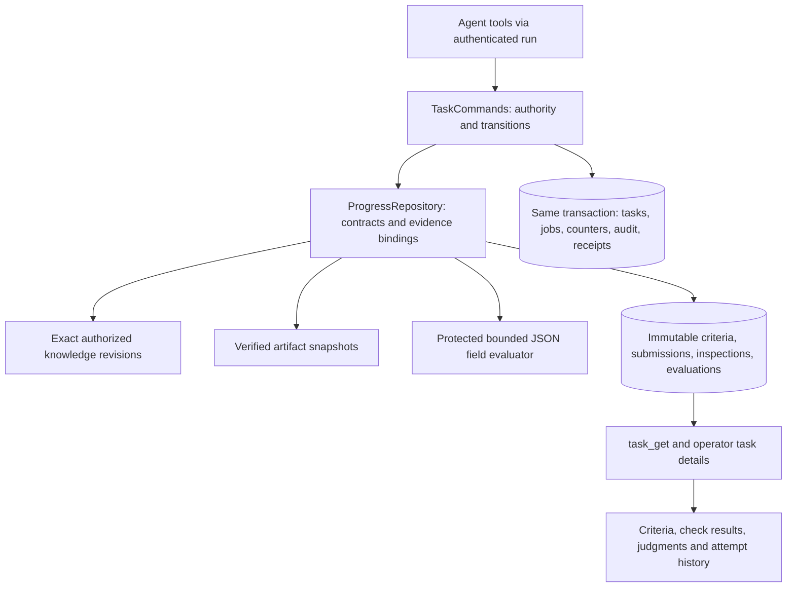

# Criterion-bound evaluation implementation

Status: implemented first increment, 2026-09-23. This implements the task-level
contract in [design 4](designs/04-progress.md#first-implementation-contract),
following the [knowledge and evidence review](REVIEW-2026-09-23.md). It does not
complete the broader mission-evaluation or live-pilot design.

## What changed

Tasks now have frozen criteria, immutable evidence submissions, protected data
check results, submission-specific inspection receipts and independent evaluations.
A reviewer cannot accept a failed required check, reuse reads from another
submission, omit a criterion, or review a stale submission as if it were current.
Rejected attempts remain accessible after correction and restart.

An acceptance string alone becomes one **subjective** criterion. Agents may
propose richer criteria at creation, but those proposals never become
operator-approved mission requirements automatically. Criteria are version 1 and
immutable for the task. There is no policy-editing endpoint. Creating another task
does not rewrite the operator's mission or establish mission attainment.

## Boundaries and data flow

All modules run inside the existing supervisor. SQLite remains the canonical
store. No new service, dependency, model call, vector database, or generic
workflow framework is required. Protected checks contain fixed platform code;
submission bytes cannot choose executable code or load an extension.

| Module | Responsibility |
| --- | --- |
| `src/application/tasks.ts` | Mission/owner/version checks, command identity, task transitions and atomic side effects |
| `src/progress/schemas.ts` | Bounded criteria, binding, verdict and read inputs |
| `src/progress/repository.ts` | Frozen policy, exact evidence identity, check orchestration, receipts and bounded history |
| `src/progress/checks.ts` | Pure, versioned data evaluator and canonical record hashing |
| `src/storage/progress-migration.ts` | Schema v4 ledgers, append-only triggers and exact legacy snapshots |
| `src/storage/artifacts.ts` | Bounded file reads verified against stored size and SHA-256 |

## Agent protocol

1. Create a task with an acceptance summary and optional typed `criteria` (up to
   12). Each criterion has an ID, description, evidence kind and evaluation method.
2. Read `task_get` to obtain the frozen contract. Work against that contract.
3. Publish artifacts or shared knowledge revisions. Submit `bindings` mapping
   every criterion to exact evidence IDs, plus a note and known limitations.
   A submission can use at most 20 distinct evidence items. The `evidenceIds`
   shorthand is supported only for a single-criterion task.
4. The platform freezes hashes, document IDs, sizes/types, criterion hash and
   protected check results in a submission. Failed/error checks still create an
   attempt and schedule review. A malformed command or inaccessible/corrupt source
   is rejected atomically before a valid submission can be recorded.
5. A different agent calls `task_get` and `task_evidence_read` for the bound
   evidence. Reads verify current access and the submitted hash. Text pages contain
   at most 12,000 characters. Binary receipts describe metadata access only.
6. `task_review` requires the exact `submissionId` and a verdict for every
   criterion, with matching evidence IDs and a rationale. Every verdict and
   protected check must pass for acceptance. Current evidence integrity/access and
   the reviewer's own submission-specific read receipts are rechecked.
7. Rejection can cite unreadable evidence without successful reads. The owner
   revises and resubmits; the earlier submission, checks and evaluation remain.

Use stable command IDs for mutations and reuse them only for identical retries.
Task versions remain available for optimistic checks. Submission identity is
mandatory for review even when `expectedVersion` is omitted. A replay returns the
original receipt without reapplying effects or reclassifying later work.

Each production submission/review/read records its authenticated principal and
job/attempt when invoked through a run. These link to the existing run ledger;
internal local fixtures have no fabricated run identity. The evaluation references
the latest successful receipt per evidence item. Earlier read ranges remain in the
inspection ledger; a referenced chunk does not imply the entire artifact was read.

## First protected check

`json.fields.v1` checks an artifact against a frozen list of required top-level
field names and types. Its input must be valid UTF-8 JSON, an object, and no more
than 250 KB. Supported types are string, finite number, boolean, array and object;
strings must contain non-whitespace text. The result records evaluator identity,
check version, policy hash, each evidence ID and an explanation.

For example, a rules manifest can require `pairs` to be a number, and `matching`
and `restart` to be nonempty strings. This catches omitted fields and wrong data
types. It does **not** establish that the pair count is correct, the rules are
consistent, a game runs, or players enjoy it. Separate criteria need appropriate
checks or clearly labelled judgments for those claims.

The evaluator performs no shell execution, network calls, reference resolution,
plugin loading or model grading. Executing candidate code still requires the
[worker containment gate](designs/03-workspaces-prs.md).

## UI and history

Task details show the frozen criteria and their proposal authority, exact evidence,
limitations, protected check results, per-criterion judgments and read provenance.
Submission history is paged five attempts at a time; older attempts can be opened
without changing current work. Historical rejection remains visible after success.
The work board identifies legacy records, and counts remain accepted-task counts,
not percentages of the mission proven complete.

`GET /api/tasks/get?taskId=...` supplies the same view to the local operator with
normal loopback authentication. `submissionId` selects an older attempt; `offset`
pages attempt summaries. No public or Discord observer API was added.

## Migration and verification

Schema v4 creates five indexed ledgers and immutability triggers. It preserves
all existing task, knowledge, event and command-receipt bytes and snapshots legacy
tasks separately. It pauses the collective. Legacy completed tasks retain their
old acceptance without fabricated criteria, check results or inspections. An old
pending review requires a fresh owner submission; the original record remains
available in task details.

Run `npm run migration:rehearse -- .collective/collective.sqlite .collective-demo/collective.sqlite`
before upgrade. The rehearsal now verifies existing knowledge and progress tables
as well as entities, events and command receipts. Both v3→v4 rehearsals passed:
11/44 entities and 30/96 events preserved respectively, exact legacy task snapshots,
SQLite integrity `ok`, and exact restoration of the original snapshots. Source
databases were not modified by rehearsal. Startup makes a WAL-aware v3 backup
before actually upgrading. Rolling code back across the schema change requires
restoring that backup; older binaries reject the newer schema.

**106 checks pass**, including 20 added evaluation checks/subchecks. Build passes.
Coverage includes frozen/forged criteria, mismatched evidence, protected failure
and error results, owner review, missing reads, stale submissions, exact older
knowledge revisions, corruption after inspection, withdrawn sources, retry/reopen,
immutable rejected attempts, paginated history, ledger-write fault injection,
legacy adoption, and authenticated HTTP details. Existing foundation rollback
snapshots now include the new ledgers. The deterministic end-to-end rehearsal
uses the same APIs and produces a protected rules-manifest check plus explicitly
labelled fixture judgments for the game.

An isolated browser rehearsal also verified the rendered successful evaluation,
then opened its earlier rejected attempt and displayed the failed protected check,
unchanged evidence hash, limitations and preserved review. Neither existing app's
mission or task history was replaced for that UI check.

The [current diagnostic probes](progress-review-results.json) reject the old
unstructured “looks fine” review. They deliberately demonstrate that a fully
structured but bad subjective judgment can still accept unrelated knowledge.
R4's protocol gaps are addressed; semantic correctness remains a separate problem.

## Remaining work and next priority

This is a trustworthy record of **what was evaluated**, not a guarantee that
agents choose useful criteria or judge well. Broad missions still need proposal
ratification, outcome observations, meaningful artifact-specific checks and
comparison against a single-agent baseline. There are no agent overrides for
failed checks, automatic rubric revisions, or operator exception records yet.

The [isolation rehearsal](ISOLATION-REHEARSAL.md) now exercises a frozen candidate
against a protected external behavior oracle in disposable containers. Publication
accepts only top-level, single-link files through a bounded no-follow descriptor
read. The rehearsal report binds to exact fixture submissions but is deliberately
not a required production check. Whole-worker containment and durable evaluator
dispatch/reconciliation remain gates; native live launches are explicitly disabled.
Then close Discord recovery/quota prerequisites and run a small supervised
two-agent pilot. Semantic retrieval remains justified by measured misses, but broad
UI or autonomous tool expansion is lower priority than validating this work cycle.

These paths are bounded for a small personal installation. A submission can still
read up to 100 MB synchronously across 20 artifact snapshots; context and other
domain history queries still lack a global budget. There is no multi-host evaluator
or measured scale claim. Cache/rebuild and write contention should be measured
before introducing distributed services.
