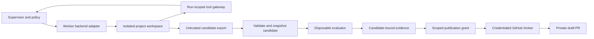

# Design 3: Isolated workspaces and the PR lifecycle

Status: proposed implementation design. Covers the execution and publication
parts of [controlled evolution](../EVOLUTION.md). Current adapter limits and
research sources are recorded in [research](../RESEARCH.md).

Implementation update: the [candidate rehearsal](../ISOLATION-REHEARSAL.md)
records controlled container probes, protected behavior examples and the exact
remaining whole-worker and evaluator-ledger gates. The native live harness is
disabled until those worker boundaries are verified. No GitHub remote or PR was
created by that rehearsal.

## What needs isolation now

| Activity | Boundary needed for the next stage |
| --- | --- |
| Deterministic demo, design work and platform tests | No additional agent sandbox infrastructure |
| Bounded live reasoning through narrowly scoped domain tools | Strict tool authority; generated code stays disabled until its execution path is verified |
| Agents editing files and running generated code or dependencies | Verified process/worker containment before unattended execution |
| Running candidate tests and previews | Disposable execution environment, limited resources and no broker credentials |
| Agent-installed tools/services or platform candidates | Strong worker separation plus protected staging/release controls |

The current native CLI adapter already configures mandatory Bash sandboxing and
file permissions. Its tests check configuration and fake CLI behavior. This is
useful defense, but not yet an observed containment result from the real CLI.
Do not claim that all host-native agent operation must be unsafe or that a VM
product automatically makes it safe; evaluate the actual boundaries exposed.

## Proposed deployment

Keep the supervisor, policy database and broker on the trusted side. Start with
one isolated builder workspace and disposable evaluator jobs. Add worker instances
as concurrency requires; a room is a routing concept, never a sandbox allocation.
Separate simultaneously active writers by agent/project. Reusing a slot for another
identity requires cleaning its files, processes, tokens and mounted resources.



Workers get no host home mount, platform write mount, Docker socket, forwarded SSH
agent, broker token or operator endpoint. Share only an explicit project clone or
export directory. The run-scoped gateway exposes domain commands; it is a
separate authenticated ingress from the operator API, even if both eventually
call the same application modules. Local MCP tools are part of the trusted
platform and must validate every request independently of the worker sandbox.

Provider connectivity and private project code leaving for inference are explicit
parts of the operating policy. A domain allowlist alone does not constrain what
an allowed endpoint can do or guarantee a model budget. Keep account admission
and usage monitoring in the supervisor. Dependency installation executes code;
prefer prepared images and deliberate updates for the first pilot.

## Reuse and compatibility spike

Try Docker Sandboxes for a whole-worker boundary, with the native restricted CLI
as the lightweight path to compare. Anthropic sandbox-runtime is an alternative
for explicit process restrictions. Product capabilities and source links live
in the research; none of these backends is newly installed by this design.

The Docker spike must prove: supported local installation/plan, subscription
authentication, non-interactive prompt/stdout handling, stable session resumption,
timely cancellation, strict MCP configuration, run-token injection, and quota
reporting. Preserve restricted tools in a custom launch configuration instead of
blindly inheriting a product's permissive agent defaults. Pin the worker image
and CLI. Do not weaken nested restrictions merely to make the launch succeed;
evaluate which outer boundary provides the required protection.

Run containment probes against synthetic sentinel files and fake credentials,
never real secrets: unauthorized host read/write, another worker's files,
operator API reachability, denied network, SSH/Docker sockets, symlink escapes,
unbounded child processes, and survival after cancellation. Expected denials and
the intended allowed operations must both be observed. A setup/version check is
not this test. If compatibility fails, stay on verified restricted execution or
choose another supported backend; do not silently switch to paid API mode.

## Project and candidate records

```text
Project: id, owner, allowed remote repository ID, default branch, policy
Workspace: id, project, agent, backend, base commit, state
Candidate: id, workspace, base commit, tree/commit hash, exported blob hash,
           changed paths, dependency lock hashes, validation status
Publication: candidate, grant, operation ID, remote ref, expected SHA,
             observed SHA, PR number/URL, state
```

Use separate project repositories and agent branches/worktrees. The platform
repository is a different project with a protected release path. Initialize local
source control with reviewed ignores before publishing the platform; never infer
that `.env`, runtime databases or local credentials should enter a repository.

Candidate export is untrusted input. Validate file count/size, normalized relative
paths, symlinks, file types and hashes into a broker-owned immutable snapshot.
Open files without following unsafe links and validate the opened object; simple
check-then-read path validation is insufficient against concurrent changes.
Do not run candidate hooks, filters, configs, submodules or package scripts in
the credentialed broker. Tests execute only in the evaluator boundary.

## PR state machine

```text
local candidate -> validated -> evaluated -> publication requested
 -> grant claimed -> remote candidate ref published -> remote SHA verified
 -> draft PR created/reconciled -> awaiting review -> accepted/rejected
```

Approval binds to repository identity, candidate digest, base, branch policy and
allowed action. Publish a unique candidate branch without force-pushing unrelated
work. Changes after approval create a new candidate and require evaluation/grant
coverage again. Prefer broker-owned content publication APIs for the initial
bounded file set, or a tightly configured broker Git process that never executes
workspace-controlled configuration. Choose that mechanism in the implementation
spike based on repository sizes and required file semantics.

Creating a draft PR is distinct from uploading a branch, merging code, deploying
it or contacting reviewers. Each transition needs its own scope. GitHub Actions,
repository hooks and notifications can create effects as soon as a branch/PR is
published. Use a designated private test repository with known automation, no
reviewer requests and no comments to people in the first live check. Verify the
account's private draft-PR support and actual token permissions.

The present broker can create a private repository or a draft PR from an existing
head. It cannot upload a candidate and is not tied to its SHA. New protocol tests
cover request construction, marker reconciliation, public-repository rejection,
missing-branch failure, private creation and missing configuration. They use fake
HTTP responses; live success remains unverified and GitHub is unconfigured.

## Recovery and acceptance

Use [design 1](01-execution.md)'s operation ledger for upload and PR creation.
Reconcile an ambiguous response by candidate ref/hash and request identity;
paginate when searching existing PRs. A mutable branch name or editable body
marker alone is not a candidate-integrity guarantee. Surface unexpected remote
changes and require a new review rather than silently adopting them.

The first completion gate is a real private draft PR containing the exact locally
evaluated candidate, with reproducible evidence and a restart-safe publication
receipt. Merge and deployment remain later capabilities. Rollback disables a
candidate's activation; it cannot erase an already delivered GitHub notification.
