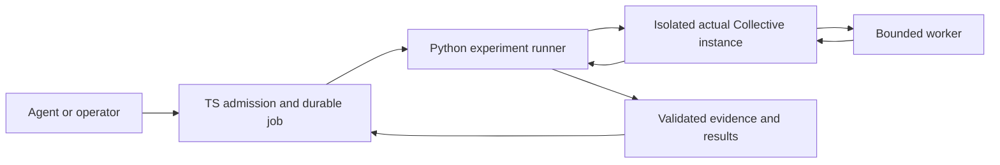

# Design 5: A reproducible, independently checked work cycle

Status: accepted direction, implementation in progress. Research and deferred
experiments are retained in [the research record](../EVALUATION-RESEARCH.md).
The first scenario/domain-bridge implementation is recorded
[separately](../WORK-CYCLE-IMPLEMENTATION.md); it does not enable live workers.
Refines [progress design](04-progress.md) and [worker admission](../WORKER-REHEARSAL.md).

## Objective and order

Provide one command that creates isolated fixture state, runs the actual
application commands and scheduler, records evidence, checks outcomes, and cleans
up. Begin with a deterministic worker; use the same scenario boundary for a real
Claude worker after its admission gates pass. Never claim a scripted worker is
evidence of model quality or real-model session recovery.

1. Define the scenario/result boundary and exercise it with deterministic tools.
2. Connect fixed MCP tools to an authenticated run through the actual transport.
3. Complete bounded VM lifecycle, snapshot transfer, reconciliation and remaining
   host-integration gates; then test one real episode under an explicit allowance.
4. Add the minimal Python/Inspect experiment adapter and repeated trials.
5. Set up Discord and compare a small producer/reviewer team with a solo baseline.

A broad Python rewrite, new workflow language, observability deployment, semantic
memory upgrade, nested swarms and additional graphics do not precede this cycle.

## Responsibility and process boundary

The TS platform owns missions, permissions, budget reservations, jobs, evidence
and acceptance. A separate Python package owns scenarios, external scoring,
repeated experiments and analysis. Isolated workers execute candidate code.
Keep one repository initially; use a versioned JSON contract across processes.
One supervisor owns run admission and cancellation; do not introduce a second
independent scheduler that can evade its resource limits.

The runner starts as a supervised process, not a mandatory network service. It
does not write the live database. The TS side validates job/attempt identity,
scenario/rubric version and exact evidence before accepting results. Keep cheap
transactional JSON checks in TS. Candidate code must not be imported into the
trusted evaluator process. Inspect may orchestrate scenarios and custom scorers;
it must not replace the Collective scheduler or reimplement domain behavior.

## First scenario

A worker retrieves an earlier constraint through knowledge tools, writes a small
JSON artifact honoring it, publishes it and submits bound evidence. The evaluator
checks exact output independently. One deliberately incorrect candidate must fail
even if it satisfies the production JSON field/type check. Submission remains in
review until the independent application review protocol completes.

Run only against a newly created temporary database/workspace and loopback server.
No live/demo data, Discord messages, provider credentials or public writes are
needed for the deterministic path. Use normal service commands through the real
authenticated tool ingress. Fixture setup may seed known starting state; report
that setup separately from actions taken by the worker.

Record scenario/version and source hashes, starting fixture, worker kind,
configuration, run/attempt/mission identity, tool trace, immutable submission and
artifact hashes, checks, termination, elapsed time and known/unknown resource
usage. Secrets must never appear in artifacts, reports, argv or worker-visible
configuration. UUIDs/timestamps can vary while scenario inputs remain fixed.

Results distinguish pass, fail, error and cancelled. Missing or malformed evidence
is an error, never an empty success. An infrastructure failure cannot be scored
as candidate correctness. Cleanup must be verified before a successful report.
Retain reports on failure and return a nonzero CLI exit status.

## Authenticated bridge and lifecycle

A host-controlled MCP server binds to one run credential. Agents cannot choose
principal, mission, attempt or destination endpoint. Credentials remain on the
host. The existing application ingress authenticates before reading a body and
again before dispatch. Domain command checks remain the final authority.

Test positive work plus cross-owner mutation, duplicate command replay, pause,
mission replacement, completed-run requests and a request whose body finishes
after revocation. The fixed gateway membership test alone does not establish any
of these application properties. A reconnected transport cannot revive revoked
run authority.

For real VM execution, persist VM identity before creation. Revoke commands before
shutdown; stop the whole VM and verify stopped state. Unknown cleanup blocks a
replacement episode. On supervisor restart reconcile outstanding VM intents before
new work. Merely killing the local CLI or recovering SQLite job flags is not VM
recovery. Transfer explicit bounded snapshots; never mount the platform source or
run exported hooks on the host.

The [remaining gates](../MCP-SCOPE.md) include clipboard-write denial,
provider authentication and usage visibility. The [new bridge experiment](../WORK-CYCLE-IMPLEMENTATION.md)
verifies a fully qualified cached image reference with its digest. No environment
variable or test mode should bypass these for real model execution. If the backend
cannot satisfy a boundary, record the incompatibility and choose a verified backend;
do not weaken admission until a probe passes.

## Python and later experiments

Expose a maintained machine-readable scenario result that a Python CLI can ingest
without importing TS modules. Use a single schema contract with compatibility
tests on both sides. Prove parity on good, bad, malformed and interrupted cases
before retiring any existing evaluator. Version the Python dependencies separately.
Inspect's provider bridge must not silently change subscription billing to API
spend; initial external scoring can use deterministic checks without any model.

Agents eventually request evaluations through bounded domain tools. Development
tests and protected acceptance policies remain distinct. Persist every attempt;
global resource limits cover evaluators and delegated workers. Workflow mutations
run against experimental state and require measured promotion/rollback, not direct
edits to the active platform or its grading policy.

The first real-model smoke test is not a team benchmark. After it passes, run
matched solo/team scenarios with repeated trials, independent scoring and explicit
cost/latency/intervention measures as described in the research record.
